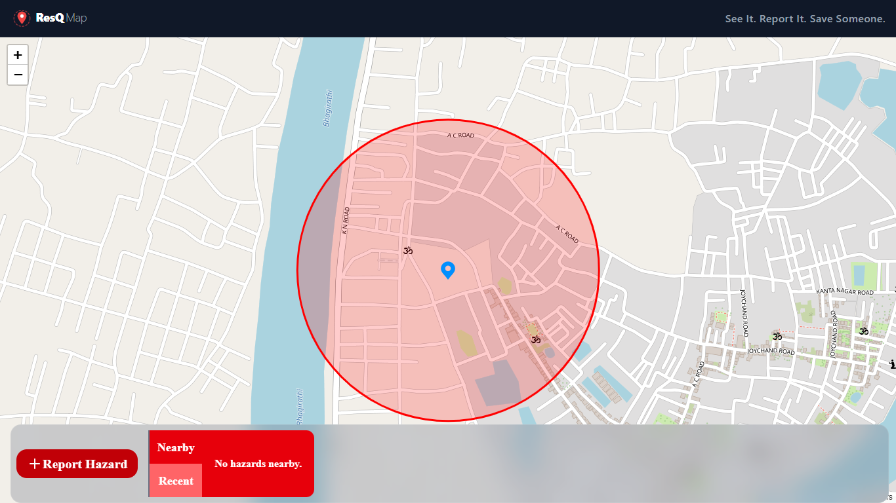
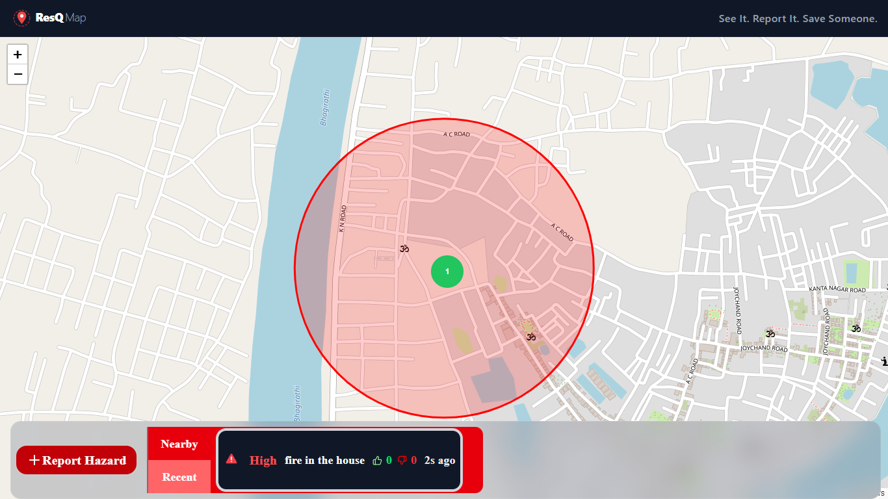
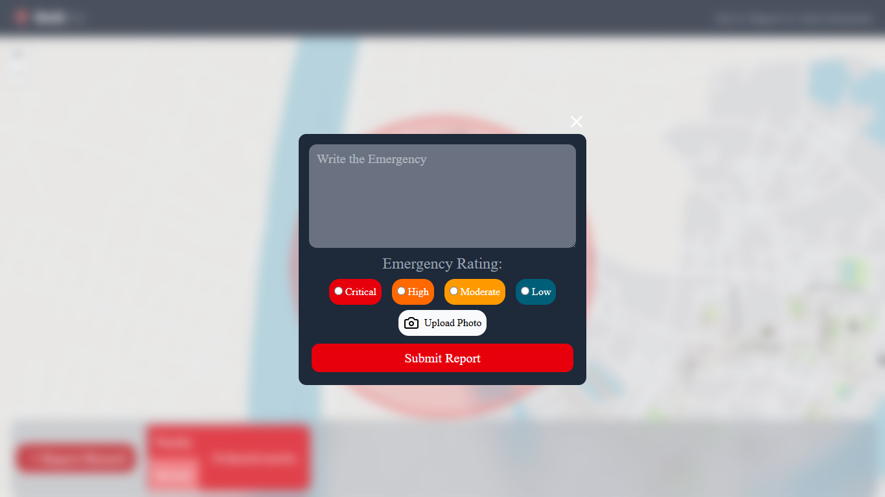
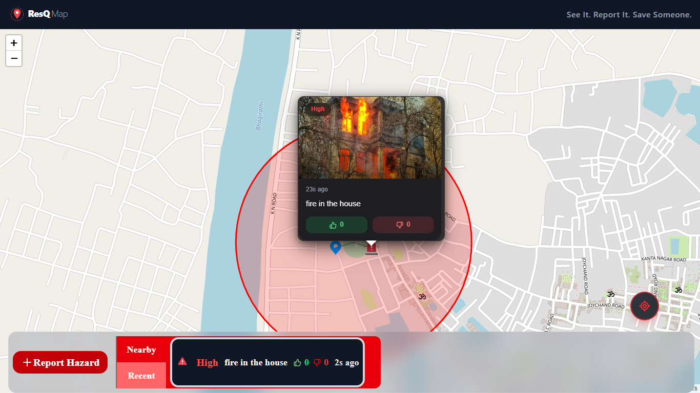

# 🚨 ResQMap — Community Emergency Reporting Platform

ResQMap is a real-time emergency reporting and awareness platform that allows users to instantly report disasters and dangerous situations directly on an interactive live map.

The platform is designed to improve public safety through:
- 📍 Live geolocation tracking
- 🗺️ Real-time map visualization
- 🚨 Instant emergency reporting
- ☁️ Cloud-based synchronization
- 📷 Image evidence uploads

---

# 🌐 Live Features

## 🗺️ Real-Time Interactive Map
- Live map interface powered by OpenStreetMap + React Leaflet
- Dynamic GPS-based user location tracking
- Automatic map recentering
- Emergency radius visualization
- Marker clustering for crowded areas
- Custom emergency markers

---

## 🚨 Emergency Reporting System

Users can instantly report:

- 🔥 Fire
- 🌊 Flood
- 🚗 Accident
- ⚠️ General Emergencies

### Each Report Includes
- Live coordinates
- Emergency description
- Severity level
- Image/photo upload
- Timestamp
- User information

---

## 📷 Photo Upload Support
- Mobile camera support
- Cloudinary image hosting
- Real-time image preview
- Optimized cloud delivery

---

## 📍 Live GPS Tracking
- Automatic user location detection
- Nearby incident awareness
- Live map centering
- Radius-based emergency visibility

---

## 🔥 Severity Classification System

Emergency reports are categorized into:
- Critical
- High
- Moderate
- Low

This helps users quickly understand nearby danger levels.

---

## 🧠 Smart Marker Clustering
- Automatic clustering of nearby incidents
- Cleaner map visualization
- Better emergency density tracking

---

## 🔐 Authentication System
- Firebase Authentication
- Secure report submission
- User session handling

---

## ☁️ Real-Time Cloud Database

Powered by Firebase Firestore:
- Real-time synchronization
- Instant updates
- Scalable cloud architecture
- Automatic report management

---

# 🛠️ Tech Stack

## Frontend
- React 19
- Vite
- Tailwind CSS v4
- React Portal

## Mapping & Location
- Leaflet.js
- React Leaflet
- React Leaflet Cluster
- OpenStreetMap
- Browser Geolocation API

## Backend / Cloud
- Firebase Firestore
- Firebase Authentication
- Cloudinary

## Utilities & Libraries
- Lucide React Icons

---

# 📂 Project Structure

```bash
src/
│
├── components/
│   ├── Map.jsx
│   ├── ReportForm.jsx
│   ├── CustomPopup.jsx
│   ├── NearbyReports.jsx
│   ├── RecentReport.jsx
│   ├── Reports.jsx
│   ├── Navbar.jsx
│   ├── Footer.jsx
│   └── Recenter.jsx
│
├── firebase/
│   ├── auth.js
│   ├── firestore.js
│   ├── uploadReport.js
│   ├── useReports.js
│   └── voteReport.js
│
├── hooks/
│   └── useLiveLocation.js
│
├── handlers/
│   └── useReportForm.js
│
├── utils/
│   ├── distance.js
│   ├── notify.js
│   └── timeAgo.js
│
└── App.jsx
```

---

# ⚙️ Installation Guide

## 1️⃣ Clone Repository

```bash
git clone https://github.com/SuvramChowdhury/ResQMap.git
cd ResQMap
```

## 2️⃣ Install Dependencies

```bash
npm install
```

## 3️⃣ Configure Environment Variables

Create a `.env` file in the root directory.

```env
VITE_FIREBASE_API_KEY=your_api_key
VITE_FIREBASE_AUTH_DOMAIN=your_auth_domain
VITE_FIREBASE_PROJECT_ID=your_project_id
VITE_FIREBASE_STORAGE_BUCKET=your_storage_bucket
VITE_FIREBASE_MESSAGING_SENDER_ID=your_sender_id
VITE_FIREBASE_APP_ID=your_app_id

VITE_CLOUDINARY_CLOUD_NAME=your_cloud_name
VITE_CLOUDINARY_UPLOAD_PRESET=your_upload_preset
```

## 4️⃣ Start Development Server

```bash
npm run dev
```

---

# 📱 Core Functionalities

## ✅ Live Incident Visualization
All reports instantly appear on the map after submission.

## ✅ GPS-Based Reporting
Users can report emergencies using their exact live location.

## ✅ Real-Time Firestore Sync
No manual refresh required.

## ✅ Mobile Friendly Design
Optimized for smartphones and field reporting.

## ✅ Auto Cleanup System
Expired reports can be removed automatically.

---

# 🖼️ Screenshots

Add screenshots inside a `screenshots` folder in your project.

Example:

```md





```

---

# 🚀 Future Improvements

- AI-based fake report detection
- SOS emergency alert system
- Heatmap analytics
- Push notifications
- Admin dashboard
- User reputation system
- Progressive Web App (PWA)
- Offline reporting
- Multi-language support

---

# 🎯 Project Vision

ResQMap aims to become a scalable community-driven emergency awareness platform where people can collectively improve public safety through instant reporting and live geographic visibility.

---

# 🤝 Contribution

```bash
1. Fork the repository
2. Create a feature branch
3. Commit your changes
4. Push to your branch
5. Open a Pull Request
```

---

# 📄 License

This project is licensed under the MIT License.

---

# 👨‍💻 Developed By

ResQMap Team

Repository:
https://github.com/SuvramChowdhury/ResQMap

---

# ⭐ Support

If you found this project useful, consider giving it a star on GitHub ⭐